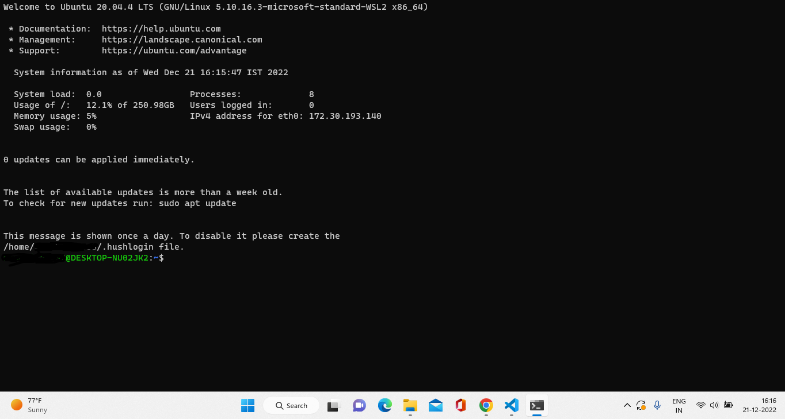

# RUN Validator on Server

This document will help you to setup a validator node.

<b>IMPORTANT:</b>Ubuntu 18 or later versions required.

## Prerequisit

- Physical
    - 24 hr running Server
    - High connectivity

- Software 
    - [NodeJS installed](./NODEJS.md)
    - [Geth Installed](./GETH.md)
    - [GitHub Intalled](./GITHUB.md)
    

After you have everything installed.
Lets start by generating keystore

## Clone `keypair-utill ` repo

Open linux terminal by pressing `Ctrl+Alt+T` key




You are in terminal create a dir by `mkdir workspace`. And go to that directory by `cd workspace`.

now clone the git repos here by 

```bash  
git clone https://github.com/SPV-Network/keypair-utill.git
git clone https://github.com/SPV-Network/consensus-system.git

```

These two consecutive commands will clone two different repo `keypair-utils`, `consensus-system`,

Now,

```bash  
cd keypair-utils
node keygen.js
```

Answer all the question and There is your seed phrase generated.
Copy it and STORE in a safe place

Now copy keystore folder from `cp ./blockchain/.ethereum/keystore /home/$user/.ethereum`

initialize the genesis file using the command below
```bash
geth init keypair-utill/blockchain/genesis.json
```

now create a service file named as `spv_geth.service` in the following location -- `/usr/lib/systemd/system`

```bash  
[Unit]
Description=spv client
After=network.target 
Wants=network.target
[Service]
User=root 
Group=root
Type=simple
Restart=always
RestartSec=5
ExecStart=/bin/bash start.sh
[Install]
WantedBy=default.target
```
after creating the file save it and then run the following commands -
```bash
sudo systemctl daemon-reload
sudo systemctl start spv_geth.service

````# spv-documentation
# spv-documentation
